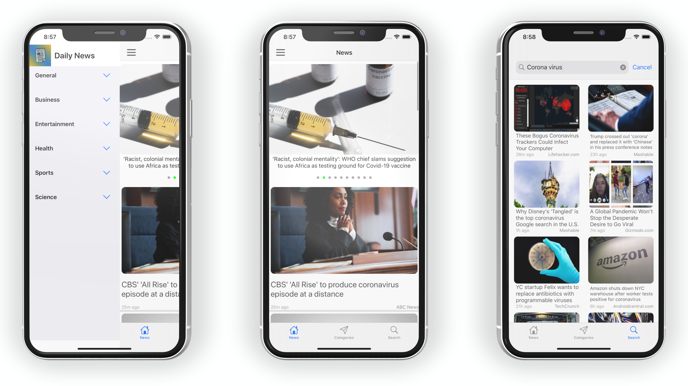
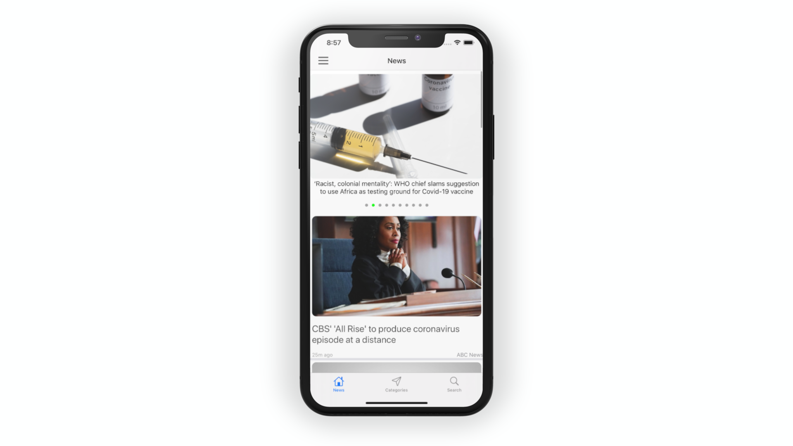
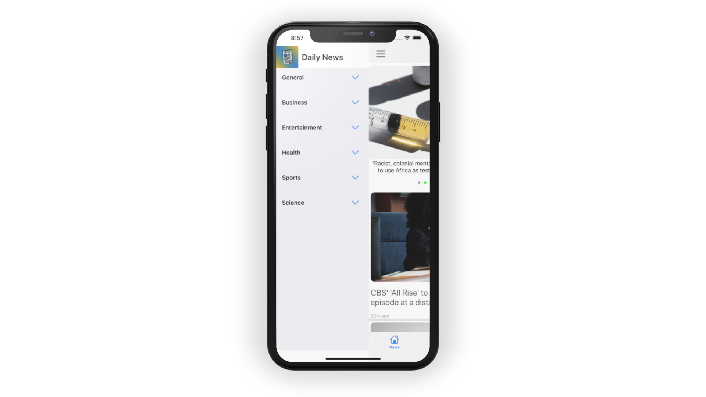
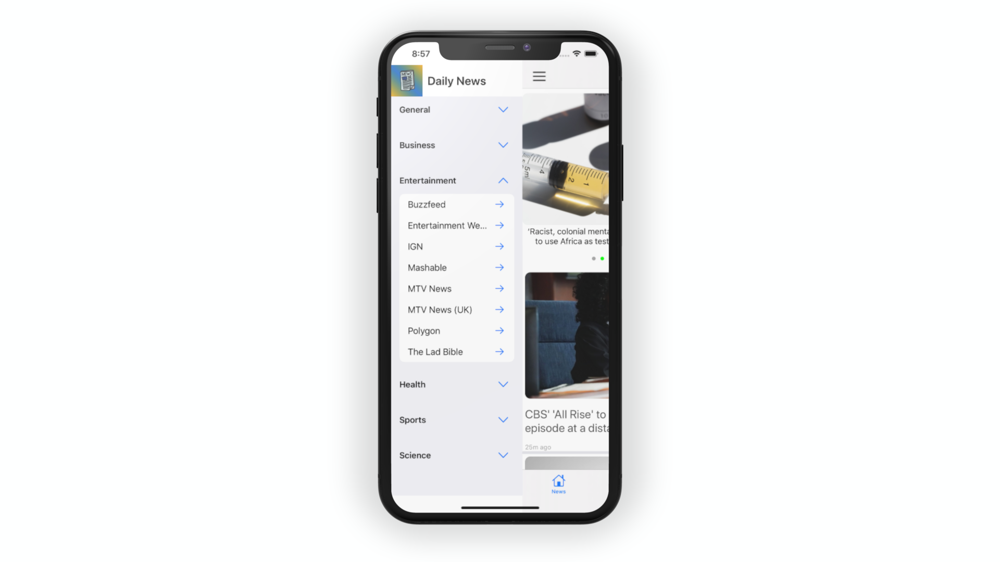
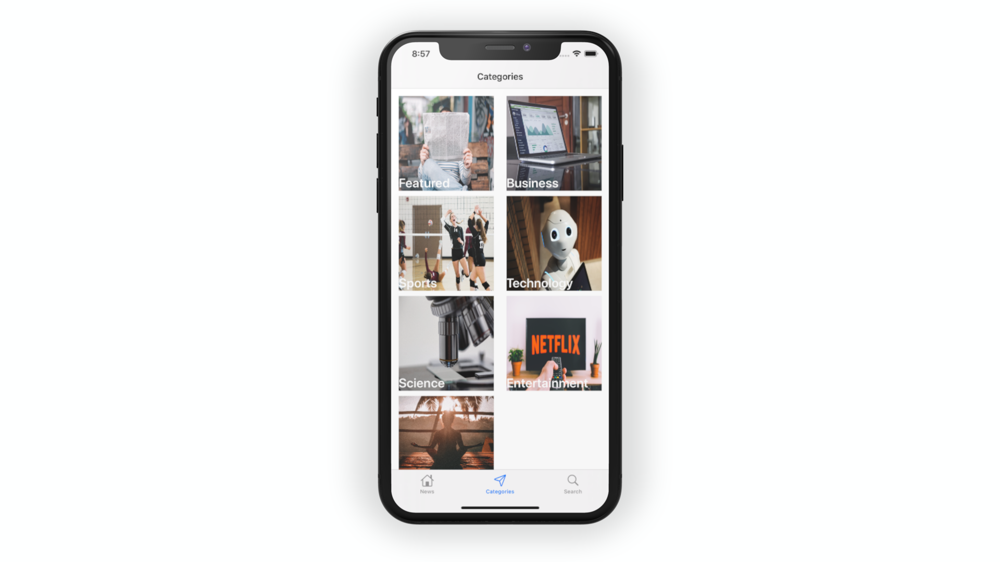
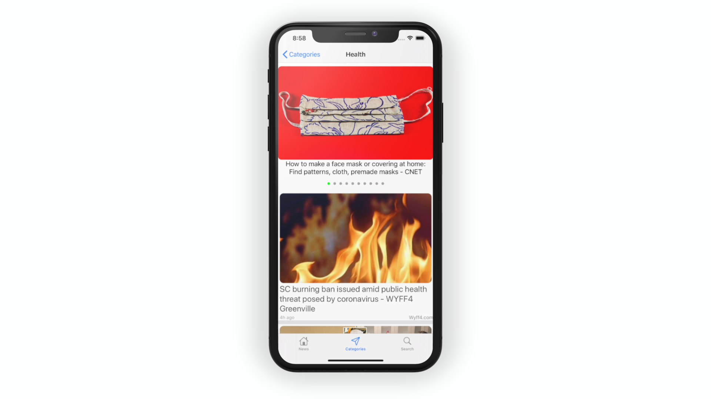
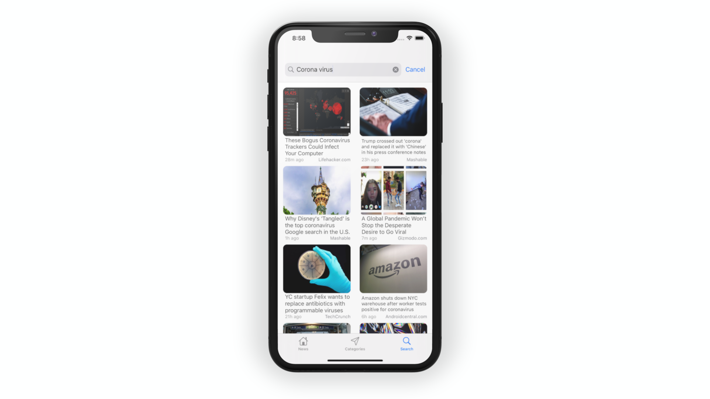
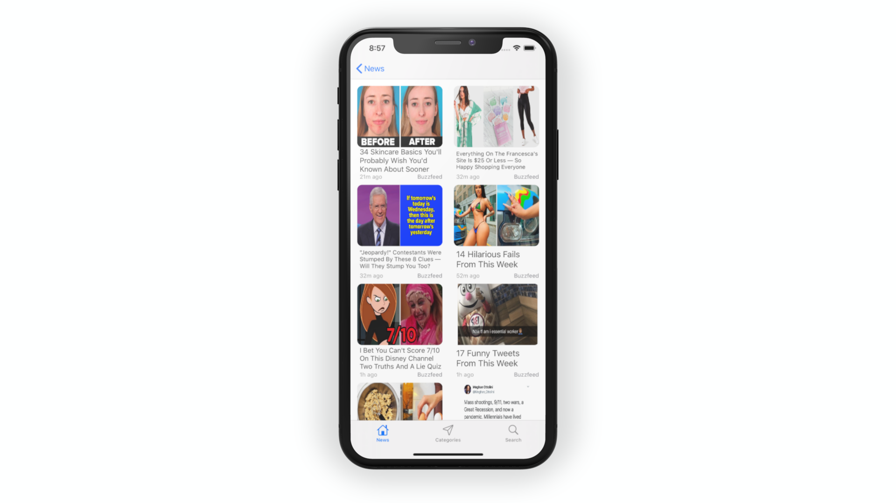

# Daily News

Hey ! Daily News is a news app with good looking user interface ! Apps architecture is MVVM and used RxSwift for binding.  

# Architecture
I preferred MVVM for this project because its more testable and maintainable than MVC. And VIPER would be an overkill for this project. I have solved binding problem with Functional Programming using RxSwift.  

# Features
-Functional Programming with RxSwift  
-Nested collection views.  
-Custom views and layouts  
-Pagination  
-Programmatically UI  
-Unit Tests for networking and view models.

# Todos
-Implement side Menu with screen edge pan and tap gestures.  
-Add Unit tests for Search Screen  
-Add refreshing to every screens.  
-Subscribe to errors and show alert.  

## Upcoming
-I will use Apple's Combine framework and Delegation Pattern for binding in different branches to see cons and pros of three different binding solution for MVVM.

## 3rd Party Libraries
-[SDWebImage](https://github.com/SDWebImage/SDWebImage)  
-[RxSwift](https://github.com/ReactiveX/RxSwift)   
-[TinyConstraints](https://github.com/roberthein/TinyConstraints)  

## Usage
It is powered by NewsAPI! You should get your free developer API key from [NewsAPI](https://newsapi.org) and add it to DailyNews/Networking/APISettings.swift. 

# ScreenShots

## License

MIT
